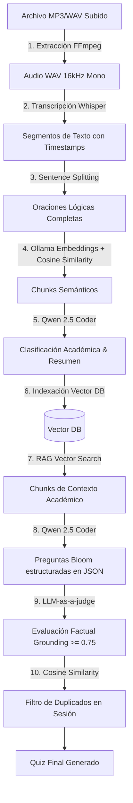

# Quiz Generator Pipeline (IA) - Arquitectura y Tecnologías

Este documento detalla el diseño, flujo de datos y tecnologías utilizadas en el pipeline de generación de cuestionarios educativos universitarios utilizando Inteligencia Artificial local. El pipeline está implementado en dos versiones: **Python** (como POC de microservicio) y **C# (.NET 10)** (como stack unificado nativo).

Para instrucciones paso a paso sobre cómo levantar, compilar y ejecutar ambas soluciones, consulte el documento [HOWTO.md](file:///home/ubuntu/quiz/HOWTO.md).

---

## 🛠️ Stack Tecnológico e Integraciones

| Etapa del Pipeline | Componente Python (POC) | Componente C# (.NET 10) | Rol en la Solución |
| :--- | :--- | :--- | :--- |
| ** API / Orquestación** | `FastAPI` (Ejecutado en Docker) | `Minimal APIs` / Consola nativa | Recibir las solicitudes de procesamiento y coordinar las etapas del pipeline. |
| **Procesamiento de Audio** | `ffmpeg` (instalado en contenedor) | `ffmpeg` (binario del host de Linux) | Convertir audios en formatos genéricos (MP3, MP4) a WAV PCM de 16kHz mono (formato requerido por Whisper). |
| **Motor de Transcripción** | `faster-whisper` (Python CPU) | `Whisper.net` (Bindings nativos C++) | Procesar el audio WAV y devolver segmentos de texto estructurados con marcas de tiempo. |
| **Segmentación de Voces** | `librosa` + `scikit-learn` (KMeans) | Whisper Timestamps (Diarización simplificada) | Identificar los turnos de habla y asociar los fragmentos transcritos a locutores virtuales. |
| **Similitud Coseno** | `numpy` | `System.Numerics.Tensors` | Calcular la similitud semántica entre vectores para la segmentación de chunks y la eliminación de duplicados. |
| **Abstracción de LLM** | Inyección de Prompts en JSON crudo | `Microsoft.Extensions.AI` | Interactuar de forma unificada con Ollama para tareas de clasificación, resumen y generación de texto. |
| **Persistencia Vectorial** | `qdrant-client` (gRPC/HTTP) | `Qdrant.Client` (gRPC oficial) | Indexar y buscar semánticamente fragmentos de clase grabada mediante embeddings. |

---

## 🤖 Modelos de IA Utilizados

Todos los modelos se ejecutan de manera local para garantizar la privacidad de los datos académicos y evitar costos de APIs externas:

1. **Whisper Tiny (`ggml-tiny.bin` / `Systran/faster-whisper-tiny`):**
   * **Propósito:** Conversión de voz a texto (ASR) optimizada para CPU.
   * **Tamaño en disco:** ~75 MB.
2. **Nomic Embed Text (`nomic-embed-text`):**
   * **Propósito:** Generar embeddings vectoriales de 768 dimensiones a partir de texto. Es el modelo responsable de posibilitar la búsqueda semántica en Qdrant y el cálculo de la similitud coseno.
   * **Tamaño en disco:** ~275 MB.
3. **Qwen 2.5 Coder 1.5B (`qwen2.5-coder:1.5b`):**
   * **Propósito:** Modelo de lenguaje generativo (LLM) que realiza las clasificaciones académicas de los chunks, genera los títulos resumidos de 5 palabras, formula las preguntas bajo la taxonomía de Bloom (RAG) y realiza la validación de calidad factual (LLM-as-a-judge).
   * **Tamaño en disco:** ~986 MB (Ejecutable ágilmente en CPU de desarrollo).

---

## 🔄 Flujo de Datos del Pipeline

El ciclo de vida del procesamiento de un archivo multimedia sigue este flujo lógico secuencial:

---

## ⚖️ Comparativa de Enfoques: ¿Por qué Python en Docker vs C# en Host?

### Enfoque Python (POC)
* **Contenerizado:** Se construyó en un contenedor Docker porque las dependencias científicas de Python (`librosa`, `scikit-learn`, `faster-whisper`) requieren paquetes del sistema complejos de instalar. Docker aísla este entorno evitando conflictos ("Dependency Hell").
* **Arquitectura de Microservicio:** Diseñado originalmente como un servicio independiente para ser consumido por el backend a través de APIs REST.

### Enfoque C# (.NET 10)
* **Nativo del Host:** Corre directamente en el host para simplificar la integración del monolito y maximizar el rendimiento. 
* **Optimización SIMD:** .NET 10 compila el cálculo de similitud coseno utilizando instrucciones vectoriales nativas de la CPU (AVX) mediante `TensorPrimitives`, lo que reduce drásticamente los tiempos de procesamiento.
* **Integración del Monolito:** Facilita la adopción del pipeline de IA directamente en el backend principal modular, permitiendo orquestar las tareas en segundo plano mediante Hangfire sobre la base de datos de PostgreSQL compartida.
