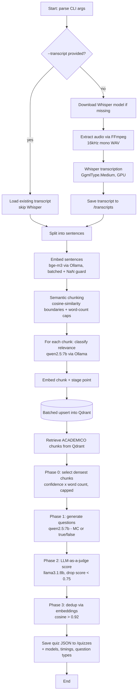

# Quiz IA Pipeline — Findings

Notes from the experiment building an automated quiz generator from recorded
class audio/video. Two parallel implementations were explored: a C# / .NET stack
(`quiz-dotnet`) and a Python FastAPI service (`poc-audio-processing`).

## Key takeaways

1. **GPU is necessary for tolerable runtime.** With GPU acceleration the full
   pipeline completes in ~15 minutes; without it (CPU only) the same run takes
   ~2 hours. Whisper transcription alone dropped from ~16 minutes (CPU) toward
   3–5 minutes once the model ran on the GPU. GPU is not an optimization, it is a
   practical requirement.

2. **Transcript quality dominates the final result.** If the transcript is poor,
   no amount of downstream effort (better LLM, better chunking, better prompts,
   judging) produces usable quizzes. The difference between Whisper `tiny`,
   `small`, and `medium` was decisive — `tiny` output was unusable, and moving to
   `medium` was the single biggest lever on question coherence. Garbage in,
   garbage out applies strongly here.

3. **Language choice (C# vs Python) is secondary to transcript quality.** Porting
   the pipeline to Python yields no meaningful improvement if the transcript
   isn't good enough. The implementation language is an engineering/preference
   decision, not a quality lever.

## Model decisions

- **Transcription (Whisper):** quality scales hard with model size.
  `tiny` → unusable, `small` → acceptable, `medium` → noticeably better Spanish.
  Larger models cost more time/VRAM but are worth it for coherent questions.
- **LLM for generation/classification:** moved from `llama3.2:3b` to
  `qwen2.5:7b-instruct`. The small 3B model produced incoherent questions; the
  7B class was a clear step up in reasoning and Spanish quality.
- **LLM-as-a-judge:** uses a *different* model family (`llama3.1:8b-instruct`)
  from the generator to reduce self-bias when scoring questions.
- **Embeddings:** switched `nomic-embed-text` (768-dim, English-centric) to
  `bge-m3` (1024-dim, multilingual) for better Spanish semantic similarity.

## Pipeline / performance learnings

- **Model-swap thrashing was a hidden cost.** Alternating generator and judge
  models per question forced Ollama to unload/reload multi-GB models on every
  call. Restructuring into phases (generate all → judge all → dedup all) so each
  model loads once was a major speedup, especially on limited VRAM.
- **VRAM budget matters.** On a 12 GB GPU (RTX 4080 Laptop) two LLMs (7B + 8B)
  cannot stay resident together. `OLLAMA_MAX_LOADED_MODELS=1` plus the phased
  design keeps one model fully on GPU at a time with a clean swap, avoiding CPU
  spillover.
- **Don't generate from every chunk.** Generating a question per chunk was slow
  and diluted quality. Selecting the most significant chunks
  (classifier confidence × concept density) before generating cut cost and
  improved relevance.
- **Chunk size/quantity is a tuning knob.** Smaller chunks → more classification
  LLM calls and thinner context. Raising the minimum chunk size and lowering the
  split-similarity threshold produced fewer, larger, more coherent chunks
  (~halved the count) and reduced classification cost.
- **Removed a wasteful summary call.** A per-chunk topic-summary LLM call was
  removed; it cost a second LLM round-trip per chunk for no downstream value.
- **Question volume should be dynamic but bounded.** Adaptive target of roughly
  one question per N academic chunks, clamped to a sensible range (≈5–25),
  rather than a fixed count.

## Robustness learnings

- **Embedding NaN crashes.** `bge-m3` via Ollama can emit a `NaN` vector for
  degenerate/empty inputs, which Ollama fails to JSON-encode
  (`json: unsupported value: NaN`) and which kills an all-in-one batch call. Fix:
  batch with a per-item fallback (drop the offending item) at every embedding
  site — sentence embeddings, chunk embeddings, and question dedup.
- **Infrastructure must be up.** The pipeline depends on running Ollama and
  Qdrant containers; a host restart silently stops them and the pipeline fails
  at the first call. Worth a preflight/health check.

## Setup learnings (GPU on WSL2 + Docker)

- The host driver exposes the GPU into WSL; passing it into a container needs the
  NVIDIA Container Toolkit and a device reservation (`--gpus all` /
  `deploy.resources.reservations.devices`). Verified with `nvidia-smi` inside the
  container and `ollama ps` showing `100% GPU`.
- **Whisper.net GPU requires a matching CUDA runtime version.** The 1.9.0 Linux
  CUDA build links `libcudart.so.13` / `libcublas.so.13` (CUDA 13). Installing
  CUDA 12.x is not enough — the native lib silently fails to load and Whisper
  falls back to CPU with no error. The fix was installing the CUDA 13 runtime
  libraries. Silent CPU fallback made this hard to diagnose.

## Developer-experience improvements

- **Transcript reuse.** A `--transcript <path>` flag loads a previously saved
  transcript and skips audio extraction + Whisper entirely, so quiz logic can be
  iterated without paying the transcription cost each run.
- **Traceability.** Transcripts record the Whisper model used; quizzes record the
  models (transcript / processing / embedding / judge), the Qdrant collection,
  timings, and question type. The Qdrant collection name encodes which
  implementation (Python vs C#) produced the vectors.
- **One-shot prompt example.** Adding a concrete example question to the
  generation prompt improved output format and quality.
- **Question variety.** Added true/false questions mixed in with multiple choice
  (configurable ratio) alongside the multiple-choice default.

## Workflow (C# pipeline)

Flow of `quiz-dotnet/Program.cs`. External services (Whisper, Ollama, Qdrant)
are shown where they are invoked.

### Stage → external service / model

| Stage | Service | Model |
| --- | --- | --- |
| Transcription | Whisper.net (GPU) | `whisper-medium` |
| Sentence / chunk / question embeddings | Ollama | `bge-m3` (1024-dim) |
| Classification + question generation | Ollama | `qwen2.5:7b-instruct` |
| LLM-as-a-judge | Ollama | `llama3.1:8b-instruct` |
| Vector store | Qdrant (gRPC :6334) | per-run collection `quiz_chunks_dotnet_*` |

## Effort / time proportion per stage

Measured from a full GPU run on 2026-06-01 (`Week_4.mp4`, ~2h class,
`whisper-medium`, total **15m 00s / 900.0s**). Percentages are each stage's share
of total wall-clock, taken directly from the `[TIMING]` log lines.

| Stage | Time | Share |
| --- | ---: | ---: |
| Audio extraction (FFmpeg) | 18.3s | 2.0% |
| Whisper transcription | 215.4s | 23.9% |
| Sentence splitting | 0.02s | ~0% |
| Sentence embedding + semantic chunking | 22.8s | 2.5% |
| **Classification + chunk embedding + vector store** | **500.5s** | **55.6%** |
| RAG quiz generation (select + generate + judge + dedup) | 143.0s | 15.9% |
| **Total** | **900.0s** | **100%** |

Run shape: 1025 raw segments → 947 sentences → 79 chunks (68 ACADEMICO) →
14 questions targeted → 13 accepted.

### Reading this

- **Classification + storage is the single biggest stage (55.6%).** It runs one
  classification LLM call *plus* one embedding per chunk over **all 79 chunks**,
  then a single batched upsert. Cost scales with chunk count, so fewer chunks
  directly shrinks the largest slice.
- **Whisper transcription is second (23.9%)** even on GPU (~3.5 min). On CPU this
  stage alone was ~16 min and dwarfed everything — GPU is what makes the rest
  matter.
- **Quiz generation is third (15.9%)** — generate + judge over only the selected
  14 chunks, so it's bounded by the (small) question count, not chunk count.
- Audio extraction (2.0%) and sentence embedding/chunking (2.5%) are minor;
  sentence splitting and file I/O are effectively free.
- Together the **LLM/embedding stages (classification + quiz gen) are ~71%** of
  the run — the model calls dominate once transcription is on the GPU.

### Biggest optimization levers, in order

1. **Fewer chunks** — directly cuts the 55.6% classification stage (top cost).
2. **Smaller/faster classifier model** — classification is simple bucketing; a
   3B model here would cut that stage substantially without hurting quality much
   (not yet done; currently uses the 7B generator model).
3. **GPU for Whisper + Ollama** — the order-of-magnitude win that made the
   LLM stages, not transcription, the bottleneck.
4. **Phased model loading** — avoids multi-GB model reloads between generate and
   judge on limited VRAM.
